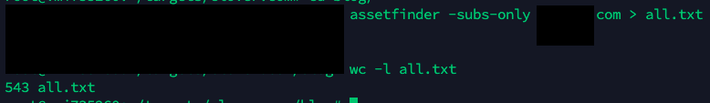
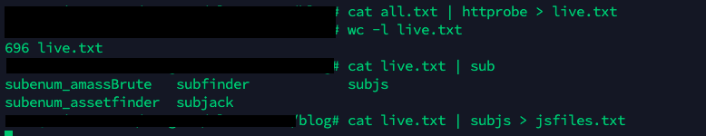
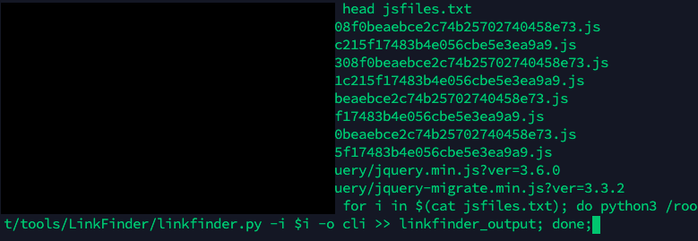
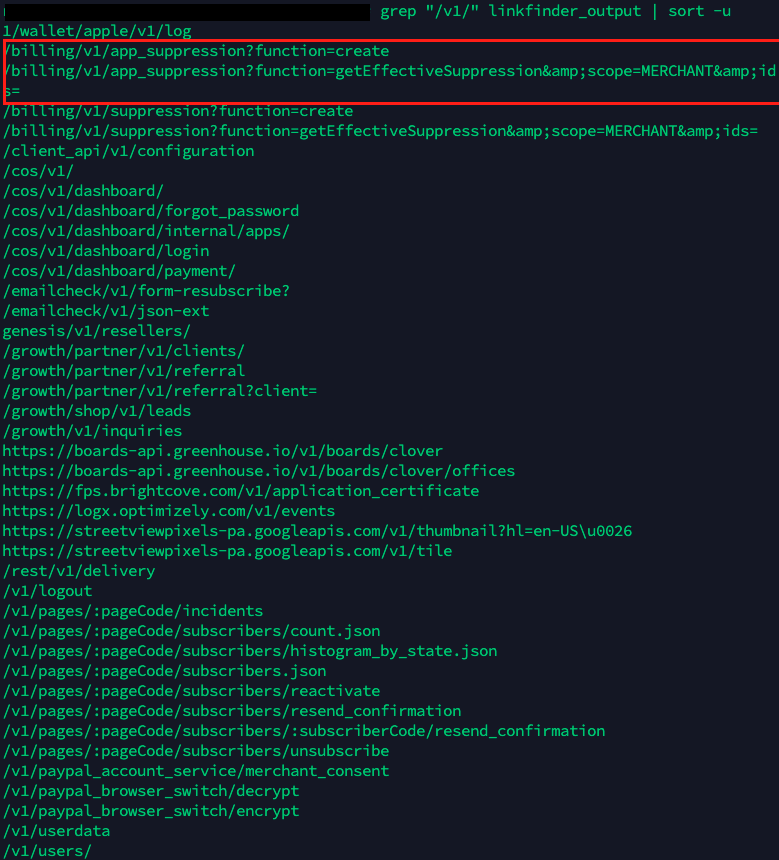
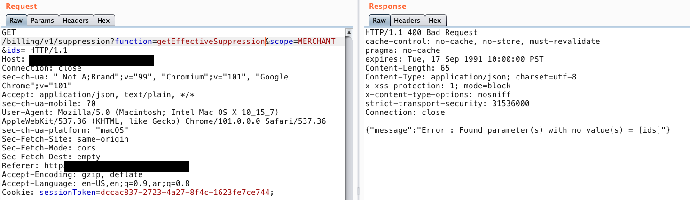
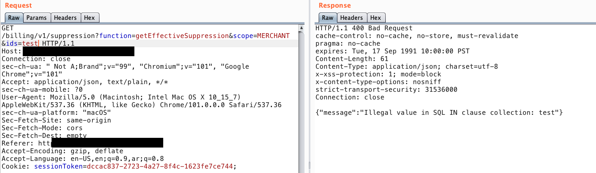
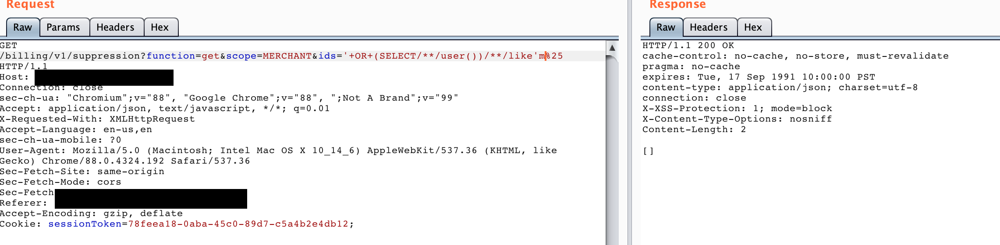
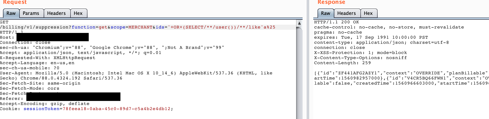

# Bug Bounty Reconnaissance from another perspective

### Introduction

Most of the new bug hunters face many problems while doing recon or even after recon. They simply don’t know how to use this data, what they are supposed to do after that?

In this blog, I have tried to focus on what you can achieve/do after the recon and what to look for after each step. This blog doesn’t explain how to do recon but rather how to take advantage of the data you have.

### Why do we need to recon?

Before we dig into the blog topic we need to understand first why we even need to do recon? We know about common vulnerabilities like SQL, XSS, SSRF, and so on. So, why do I need to recon a target?

**The answer is simple, expanding your attack surface.**

### What is the attack surface.

The attack surface is the number of all possible points, or attack vectors, where an unauthorized user can access a system and extract data. More attack vectors == more possible bugs.

Let's take an example as a building you're trying to break into. At first, you do some recon to find out where the entrance doors are. Are there any sub-buildings? Are there back doors? What about the car garage, does it have an elevator from the inside? Is the identity of visitors verified?

The reason you ask all these questions is that you simply need to find more ways to enter the building and check if you can link an entry with other to achieve what you need.

### Let’s apply this to our objective.

During the recon process, your aim is to find more assets belonging to the target company in order to expand your attack vectors.

Each time you find a subdomain, endpoint, or user-supplied data you have more attack vectors, right?

For example, during recon, you have come across a domain called `target.com`. This domain is hosted on an Apache web server and doesn’t contain any dynamic page. Here, you have a few attack vectors to test:

1. Does the used version affected by any CVEs?
2. Is there any directories hidden somewhere?
3. Does the front-end code contains any sensitive information?
4. so on…

A few days later, the owner added a new subdomain under `blog.target.com`. Again this expands your attack surface:

1. What CMS is used? Does it have any CVEs for the used version
2. Does it a dynamic page? can we self-sign up?
3. Is there any user input?

One more time, the owner added a new subdomain under `app.target.com`. Again, this also expands what you can test:

1. Can we create an account?
2. What is the main functionality of the application? what does it serve to end-users?
3. What is the user level on that app? one level access or multiply levels (admin, manager, low user)
4. Testing for OWASP top10?

Let’s jump to the recon process and see what you can achieve in each step.

### Recon Process

Don’t overload yourself with recon. It’s simple.
You need to do recon to find attack vectors for different types of vulnerabilities that you have previously learned.

**Example 1**: if you learned about XSS, SQL, and SSRF you should know that all of them relaying on user-supplied data. So it makes sense if you couldn't find those types of issues on a static website.
But you need to explore the target for more endpoints, and parameters to start testing for those types of issues.

**Example 2**: A web application that doesn't have any authenticated requests, it's designed to take some user input but from the un-authenticated point. Here, you can test for input-validation issues like above, but it doesn't make sense to try to test for IDORs for example because the root cause of IDOR is the authorixation mechanism which is not exist in our application.

With that said, you must understand that the aim of recon is to find an entry point for a vulnerability.

More subdomains == More chances to find more entry points

More URLs, endpoints or parameter == More attack vectors

More functions == More different types of issues you will have to test.

Let's dig into this more...

### Asset Discovery

- ASN Enum

    - You need to discover more assets/subnets belonging to the target company.
        - Tools
            - Amass
            - [https://bgp.he.net/](https://bgp.he.net/)
- Subdomain Discovery
    - The aim of this step is to enumerate further domains in order to expand your attack surface
        - Tools:
            - Amass
            - Assetfinder
            - findomain
            - Sublist3r
            - and more..
        - What type of issues can you find during subdomain enumeration?
            - Subdomain takeover
            - Subdomains that are mistakenly exposed to the public and contain internal admin panels
            - Subdomains that host third-party software with an outdated version that could be affected by multiple CVEs.
        - What to do next?
            - Port scanning
            - Run vulnerability scan using Nuclei.
            - For each subdomain, you need to do the following
                - Content Discovery
                    - Directory fuzzing
                    - WaybackURLs
                - Application Mapping
                    - Explore the subdomain using burp suite
                    - Crawl the subdomain
                        - hackrawler
                        - gau
                        - photon
### Port Scanning

The aim of this step is to find if there are any open ports that run other services.

- What type of service running on the opened port?

    - If it’s a Webserver, repeat the steps above.
    - Another service? google it for common misconfiguration.
        
- What type of issues can you find during port scanning?

    - Exposed Instances
    - Running Webserver without authentication.
    - Running service with an outdated version

### Vulnerability Scanning

- The aim of this step is to find common vulnerabilities using tools like Nuclei.

- What type of issues can you find during vulnerability scanning?

    - CVEs
    - Common Misconfiguration
    - Webserver vulnerabilities
    - Low hanging fruits and more
       
### Content Discovery

The step that never ends. This is one of the most important steps that you need to do and continue doing it while you explore the application. Discovering more URLs, and endpoints should be always a side-process in your recon flow. Don’t do it one time.
   
- What we can do during/after content discovery?
    
    - Directory Fuzzing
        - Fuzz the subdomain using fuzzing tools like `FFUF`, and `Rustbuster` to find hidden directories which may reveal admin portals or files that may contain sensitive information.
          
        - Keep note of any file or directory you find even if it returns a 403,401 errors. We can re-use it on another subdomain and we get another result.
          
    - WaybackURLs
        - Check for the URLs from Wayback machine and split the URLs ⇒ extract the endpoint and generate a list of those URLs
        - Try to check those URLs if they have `/api/` endpoints and try to play with this API.
        - Re-use those endpoints with all the subdomains you have discovered.
        - If you found `[https://target.com/path/to/something](https://target.com/path/to/something)` , use `path/to/something` with another subdomain may be an endpoint deleted from a subdomain was still exist on another.
        - Check URLs that contain parameters and use a tool like `hakrawler` to get the status code of each URL, or use a tool to take a screenshot for each URL
        - If the URL is alive, try to identify what the parameters have to do with the URL:
            - Does it affect the request?
            - What is used for? does it reflect back or have something to do with the back-end database. From here you have to test for common user-input vulnerabilities
     
     - Javascript Endpoint Discovery
         - Use a tool like `subjs` to extract all JS files from a list of subdomain
         - Loop through the output using a tool like `LinkFinder` to extract all endpoints from those files ⇒ and add them to the list we have generated above.
     
     - Parameter Discovery
        - Use tools like `Arjun`, or `ParamSpider` to find the hidden parameter for any interesting URL you have discovered.

- What type of issues can you find during content enumeration?

    - Information Disclosure through debug files
    - Information Disclosure through exposed/sensitive files
    - Leaked documents like PDF files that contain sensitive information

### Putting it all together

I would walk you through one of the SQL injection vulnerabilities that I have recently found which I wouldn't be able to find without proper recon.

Let's call the target `vuln.com`. I was hurting on this target for several years and I was focusing on the application functions themselves.
The main application usually interacts with a back-end API under `/api/v3/`. When I decided to go back hunting again on this target, I told myself to start from the beginning and act as if this is my first time hunting on them. I just need to find more attack vectors.

The first thing you need to plan is to set your goal/objective. My goal was to find more API endpoints related to this target.
I have played with most of the APIs under `/api/v3` before and tested them, I need to discover other paths or maybe another API version under `/api/v1-v3`!

1. Subdomain Enumeration

`assetfinder -subs-only vuln.com > all.txt`

2. Filter alive targets

`cat all.txt | httprobe > live.txt`

3. Let's enumerate all possible JS links from this list using `subjs`

`cat live.txt | subjs > jsfiles.txt`

4. Extract all endpoints from those files using `LinkFinder` with one-liner.

`for i in $(cat jsfiles.txt); do python3 /root/tools/LinkFinder/linkfinder.py -i $i -o cli >> linkfinder_output; done;`

5. Let's grep for some specific strings like `/v1`, `/v2/`, and `/v3/`

`grep "/v1" linkfinder_output.txt | sort -u`

The output shows some endpoints which I haven't seen before, especially the ones under `billing`. So, one could ask me what next?
What we have done until here is that we have discovered a new endpoint with new parameters, so we have more attack vectors. We could start doing some analysis to check what this API aims to do and check for common injection on the existing parameters.
First, we need to make sure this endpoint is actually valid on our target. So I fired burp suite and captured one of the valid requests to the back-end API

6. Send the request as normal

Great, the endpoint is valid and excepted a value to be passed to `ids` parameter.

7. Adding some random strings to `ids` parameter

8. hmmm, things become more exciting. The server response shows that it clearly takes out input and interacts with the DB. From this point, I have started testing for SQL Injection.
SQLmap doesn't work and the WAF was setting in front of me, so I had to do it manually.

9. Valid query

10. Invalid query

Using this, I was able to extract data. I submitted the report and scored a high bounty.

### Conclusion

The problem with new bug hunter is that they usually use a lot of tools at a time and doesn't know deeply what this tool should give them, or what they need to achieve by using it.
I would recommend being patient and using the tools only when you feel that you need them to achieve something, with that you will be able to use the output for the next step.

As you can see from the previous example, I haven't done any magic tricks, I just used the tools to help me achieve what I need. Always keep in mind that recon tools exist to help you achieve something and not to find vulnerabilities for you.
